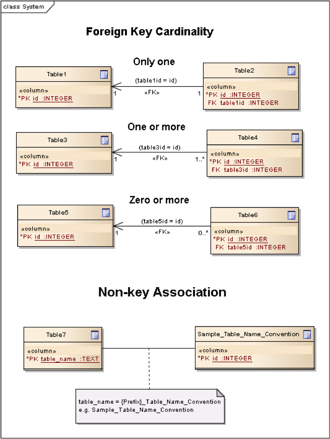
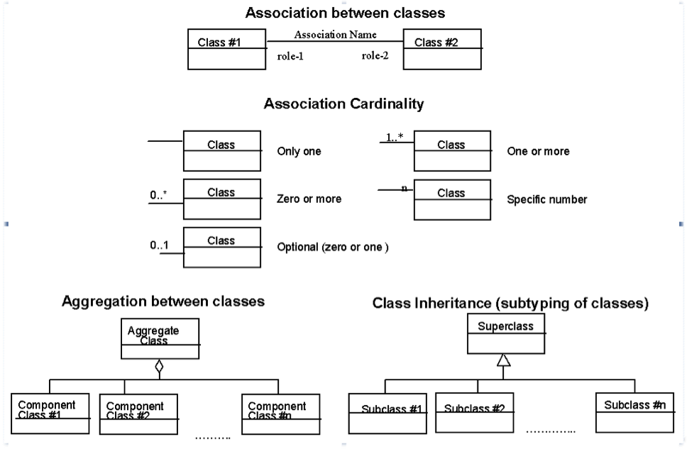

Background and Context (Informative)

Preface
-------

An open standard non-proprietary platform-independent GeoPackage
container for distribution and direct use of all kinds of geospatial
data will increase the cross-platform interoperability of geospatial
applications and web services. Standard APIs for access and management
of GeoPackage data will provide consistent query and update results
across such applications and services. Increased interoperability and
result consistency will enlarge the potential market for such
applications and services, particularly in resource-constrained mobile
computing environments like cell phones and tablets. GeoPackages will
become the standard containers for “MyGeoData” that are used as a
transfer format by users and Geospatial Web Services and a storage
format on personal and enterprise devices.

This OpenGIS® GeoPackage Implementation Specification defines a
GeoPackage as a self-contained, single-file, cross-platform, serverless,
transactional, open source SQLite data container with table definitions,
relational integrity constraints, an SQL API exposed via a “C” CLI and
JDBC, and manifest tables that together act as an exchange and
direct-use format for multiple types of geospatial data including vector
features, features with raster attributes and tile matrix pyramids,
especially on mobile / hand held devices in disconnected or limited
network connectivity environments.

Table formats, definitions of geometry types and metadata tables,
relational integrity constraints, and SQL API are interdependent
specification facets of the SF-SQL [13][11][12] and SQL-MM (Spatial)
[14] standards that serve as normative references for the vector feature
portion of this specification.

This specification attempts to support and use relevant raster types,
storage table definitions, and metadata from widely adopted
implementations and existing standards such as WMTS [22] and ISO
metadata [42], to integrate use of rasters as attributes of geospatial
features, and to define relational integrity constraints and an SQL API
thereon to provide a raster analogy to the SF-SQL and SF-MM data access
and data quality assurance capabilities.

Conformance classes for this specification are classified as core
(mandatory) and extension (optional). The simple core of an Empty
GeoPackage contains two SQL tables.

Future versions of this specification willmay include requirements for
elevation data and routes. Future enhancements to this specification, a
future GeoPackage Web Service specification, and modifications to
existing OGC Web Service (OWS) specifications to use GeoPackages as
exchange formats willmay allow OWS to support provisioning of
GeoPackages throughout an enterprise or information community.  

Submission Contact Points
-------------------------

Submitting Organizations
------------------------

The following organizations submitted this Implementation Specification
to the Open Geospatial Consortium Inc. as a Request For Comment (RFC).

- Envitia
- Luciad
- Sigma Bravo
- The Carbon Project
- U.S. Army Geospatial Center
- U.S. National Geospatial Intelligence Agency

*Table A.3: Revision history*
----------------

| Date                    | Rel   | Editor                 | Paragraph modified                                                                    | Description |
|-------------------------|-------|------------------------|---------------------------------------------------------------------------------------|-------------|
| 2012-11-15              | r1    | Paul Daisey            | 10.3                                                                                  | Remove min/max x/y fields from all tables and text in clause 10.3 Tile Table Metadata per change request 250 / 12-135.|
| 2012-11-15              | r1    | Paul Daisey            | 10.2, Annex B                                                                         | add compr\_qual\_factor and georectification columns to raster\_columns table create statement and sample insert statement; add triggers for those columns matching those for \_rt\_metadata per change request 251 / 12-134|
| 2013-01-15              | r2    | Paul Daisey            | 8.2                                                                                   | Change gpkg\_contents description default value per change request 255 / 12-166|
| 2013-01-15              | r2    | Paul Daisey            | 9.2, Annex A                                                                          | SRS Table Name Change per change request 256 / 12-165|
| 2013-01-16              | r2    | Paul Daisey            | 7, Figure 2                                                                           | table diagram gpkg\_contents min\_y REAL instead of BLOB|
| 2013-01-23              | r2    | Paul Daisey            | 11.3, 8.2                                                                             | Clause reference corrections, change gpkg\_contents.identifier default value to “”|
| 2013-02-01              | r2    | Paul Daisey            | Changes to AS                                                                         | No changes to AS|
| 2013-02-01              | r2    | Paul Daisey            | 8.2                                                                                   | new last sentence and NOTE1, additional table name triggers|
| 2013-02-01              | r2    | Paul Daisey            | 9.6                                                                                   | drop tables 21, 22 and associated text|
| 2013-02-01              | r2    | Paul Daisey            | 10.5                                                                                  | misc. editorial changes|
| 2013-02-01              | r2    | Paul Daisey            | 11.2                                                                                  | REQ 71 should refer to clause 11.2 and not 11.1|
| 2013-02-01              | r2    | Paul Daisey            | 12                                                                                    | new clause 12 other data|
| 2013-02-01              | r2    | Paul Daisey            | 13.2                                                                                  | rename tables 56,57 remove “ows\_” prefix|
| 2013-02-08              | r3    | Paul Daisey            | 10.2, 10.7, 10.8                                                                      | Use -1 as "magic" value indicating "unknown" for both compr\_qual\_factor and georectification columns, and make it the default value. Remove NOTE1 in 10.7. Delete the next to last row in Table 46 - Image Routines for gpkgBboxToTiles (). Delete the corresponding sub-clause 10.8.10 Renumber sub-clause 10.8.11 to 10.8.10|
| 2013-02-22              | R3    | Paul Daisey            | Normative References, Future Work, 6, Bibliography                                    | The GeoPackage file format and SQL API are provided by SQLite, which is the GeoPackage container implementation, not just a a reference implementation.|
| 2013-03-05              | R3    | Paul Daisey            | 6.4                                                                                   | Add Security Considerations clause.|
| 2013-03-05              | R3    | Paul Daisey            | Future Work                                                                           | Streaming synchronization|
| 2013-03-30              | R3    | Paul Daisey            | Normative References, All, Bibliography                                               | Move references to geos and proj4 libraries from Normative References to Bibliography, remove references to them from main text.|
| 2013-03-30 2013-04-01   | R3    | Paul Daisey            | Reorganize document and Annexes                                                       | New Core / Extension outline.|
| 2013-03-30              | R3    | Paul Daisey            | 6.3.2.2                                                                               | auth\_name column case-insensitive|
| 2013-03-30              | R3    | Paul Daisey                                                                                                  | Add feature table layout example|
| 2013-04-01              | R3    | Paul Daisey            | All, Annex B                                                                          | Move table definition SQL to Annex B|
| 2013-04-01              | R3    | Paul Daisey            | 7.2.4                                                                                 | Remove requirements for SQL/MM functions, REQ 21 – 33.|
| 2013-04-03              | R3    | Paul Daisey            | All                                                                                   | Renumber tables, figures, normative references|
| 2013-04-09              | R4    | Paul Daisey            | 6.3.6                                                                                 | Make integer primary keys mandatory for user vector, raster and tile data tables.|
| 2013-04-09              | R4    | Paul Daisey            | 6.3.3.2,                                                                              | Rewrite clause, remove references to geometry\_columns table columns that are superfuluous in SQLite implementation.|
| 2013-04-09              | R4    | Paul Daisey            | 6.3.6.1                                                                               | Rewrite clause, remove references to SF/SQL gS and gB architectures.|
| 2013-04-18              | R4    | Paul Daisey            | 6.3.4.1, 6.3.4.2, 6.3.6.3                                                             | Remove normative references to RasterLite|
| 2013-04-19              | R4    | Paul Daisey            | 6.3.6.3                                                                               | GeoPackage description of other data tables.|
| 2013-04-29              | R4    | Paul Daisey            | All                                                                                   | Remove implementation references|
| 2013-04-29              | R4    | Paul Daisey            | 6.3.6.3, Annex G                                                                      | Remove manifest other data entries|
| 2013-04-29              | R4    | Paul Daisey            | 6.3.2.4.2, Annex B, E                                                                 | Allow metadata of specified MIME type|
| 2013-04-29              | R4    | Paul Daisey            | 6.3.2.4.3, Annex B, E                                                                 | Allow NULLs in metadata\_reference table|
| 2013-04-29              | R4    | Paul Daisey            | 6.3.3.2, new Annex F                                                                  | Geometry type codes|
| 2013-04-29              | R4    | Paul Daisey            | 6.3.2.4, new Annex L                                                                  | Feature Schema Metadata example|
| 2013-05-03              | R5    | Paul Daisey            | Future Work                                                                           | Geographic / Geodetic Geometries|
| 201305-07               | R5    | Paul Daisey            | 6.3.4.2, Annex C, E                                                                   | Remove compr\_qual\_factor and georectification columns from raster\_columns table|
| 2013-05-07              | R5    | Paul Daisey            | 6.3.2.4, 6.3.4.3, new Annex M                                                         | delete \_rt\_metadata tables add Annex M reference Annex M from note in 6.3.2.4|
| 2013-05-07              | R5    | Paul Daisey            | 7.1.1, Normative References, Bibliography                                             | Add NITF as an extension image format|
| 2013-05-07              | R5    | Paul Daisey            | 6.3.1                                                                                 | Revise Table Diagram|
| 2013-05-07              | R5    | Paul Daisey            | 7.3.3, Annex C                                                                        | Remove raster functions|
| 2013-05-11              | R5    | Paul Daisey            | 6.3.2.4.3                                                                             | metadata\_reference table is not required to contain any rows|
| 2013-05-11              | R5    | Paul Daisey            | 6.3.2.4.2                                                                             | Recommend ISO 19139 metadata|
| 2013-05-11              | R5    | Paul Daisey            | 6.3, Annex B                                                                          | Default values|
| 2013-05-11              | R5    | Paul Daisey            | 7.3.3, Annex C                                                                        | Minimal Runtime SQL Functions|
| 2013-05-11              | R5    | Paul Daisey            | 7.3.4, Annex D                                                                        | Spatial Indexes|
| 2013-05-13              | R5    | Paul Daisey            | 6, 7                                                                                  | Reformat requirement tables, unduplicate requirement text|
| 2013-05-15              | R5    | Paul Daisey            | 6.3.1, 6.3.2.4, 6.3.4.2, 7.3.5.5, Annex B, remove Annex L                             | Replace raster\_columns table, Annex L with gpkg\_data\_columns table|
| 2013-05-16              | R5    | Paul Daisey            | 6.3.2.3, 7.4, Annex G,H,I                                                             | Drop manifest table, schemas, sample document|
| 2013-05-16              | R5    | Paul Daisey            | Future Work                                                                           | Add GeoPackage Abstract Object Model|
| 2013-05-22              | R5    | Paul Daisey            | 6.2.1, 6.3.3.1,  | new 7.1.1, Annex F                                                   | Add optional support for non-linear geometry types|
| 2013-05-22              | R5    | Paul Daisey            | 7.3.2                                                                                 | Add SQLite configuration requirements|
| 2013-05-22              | R5    | Paul Daisey            | 6.3, 7.2                                                                              | Require only gpkg\_contents and spatial\_ref\_sys tables|
| 2013-05-24              | R5    | Paul Daisey            | 7.2.1.3                                                                               | Add gpkg\_extensions table|
| 2013-05-24              | R5    | Paul Daisey            | 7.3.4, Annex D                                                                        | Provide spatial index templates instead of examples|
| 2013-05-25              | R5    | Paul Daisey            | Preface, Scope, Terms, 6, 7                                                           | Simplify, rewrite, add terms, use terms|
| 2013-05-26              | R5    | Paul Daisey            | All                                                                                   | Incorporate terms, renumber requirements and tables|
| 2013-05-28              | R5    | Paul Daisey            | 6.1.2                                                                                 | Add "GPKG" as SQLite application id|
| 2013-05-28              | R5    | Paul Daisey            | 6.1.2                                                                                 | Add SQLITE PRAGMA integrity\_check|
| 2013-05-28              | R5    | Paul Daisey            | 6.2.1                                                                                 | Geometry format minor changes|
| 2013-05-28              | R5    | Paul Daisey            | 6.3.2.2, Annex E                                                                      | Remove references to raster\_columns table (removed previously)|
| 2013-05-28              | R5    | Paul Daisey            | All                                                                                   | Clause number references and text changes required by 5/22 changes|
| 2013-05-28              | R5    | Paul Daisey            | All                                                                                   | Remove comments on accepted changes|
| 2013-05-28              | R5    | Paul Daisey            | Annex E E.4                                                                           | Add non-linear geometry type codes|
| 2013-05-29              | R5    | Paul Daisey            | 7.2.4.1                                                                               | Change reference from SF/SQL to SQL/MM|
| 2013-05-29              | R5    | Paul Daisey            | All                                                                                   | Change core and extension requirement names required by 5/22 changes|
| 2013-05-29              | R5    | Paul Daisey            | Table 16                                                                              | Change extension to API to avoid overloading extension term|
| 2013-05-29              | R5    | Paul Daisey            | A.2                                                                                   | Draft changes to A.2 Conformance Classes|
| 2013-05-29              | R5    | Paul Daisey            | B.3                                                                                   | Add gpkg\_data\_columns table SQL|
| 2013-05-30              | R5    | Paul Daisey            | Revision History                                                                      | Record 5/29 changes|
| 2013-06-06              | R6    | Paul Daisey            | Preface, Submission Contact Points, Revision History, Changes to AS, Changes to IS, Future Work, Forward, Introduction, Clauses 1-5 | Remove all forward material except title page, submitting orgs, and introduction, and put in annexes.|
| 2013-06-07              | R6    | Paul Daisey            | Old Clauses 6,7 -\> New 1-3                                                           | Restructure document iaw draft Requirements Dependencies|
| 2013-06-07              | R6    | Paul Daisey            | Annex A                                                                               | Revised Requirements Dependencies and Diagram|
| 2013-06-10              | R6    | Paul Daisey            | All                                                                                   | Fix clause and requirement references based on document restructure|
| 2013-06-10              | R6    | Paul Daisey            | Annex A                                                                               | Add Abstract Test Suite (incomplete)|
| 2013-06-11              | R6    | Paul Daisey            | Clause 1,2, Annex A                                                                   | Insert Base and Extension subclauses, renumber more deeply nested subclauses|
| 2013-06-12              | R6    | Paul Daisey            | Annex G                                                                               | Remove names and codes for Z and M geometry types, add Figure 5 and geometry subtype definitions|
| 2013-06-12              | R6    | Paul Daisey            | Clause 1.2.2.6                                                                        | Rewrite clause, add new Requirement 10, 11, renumber existing and subsequent ones.|
| 2013-06-12              | R6    | Paul Daisey            | Annex D                                                                               | Add ST\_Is3D() and ST\_IsMeasured()|
| 2013-06-12              | R6    | Paul Daisey            | All                                                                                   | Add “gpkg\_” prefix to all GeoPackage metadata tables|
| 2013-06-12              | R6    | Paul Daisey            | Figure 1, 2                                                                           | Update with “gpkg\_” prefix|
| 2013-06-12              | R6    | Paul Daisey            | Annex A                                                                               | Add Abstract Test Suite (incomplete)|
| 2013-06-13              | R6    | Paul Daisey            | 1.2.4.1                                                                               | Add sentence to end of first paragraph describing gpkg\_other\_data\_columns content..|
| 2013-06-13              | R6    | Paul Daisey            | Annex A                                                                               | Add Abstract Test Suite (incomplete)|
| 2013-06-17              | R6    | Paul Daisey            | Clause 1,2,3                                                                          | Revised notes and turned them into footnotes; moved normative text into requirement statements.|
| 2013-06-20              | R6    | Paul Daisey            | All                                                                                   | Restructure document iaw SpecificationStructureAlternative3|
| 2013-06-24              | R6    | Pepijn Van Eeckhoudt   | All                                                                                   | Created and applied Word Styles and Outline List Numbering|
| 2013-06-26              | R6    | Paul Daisey            | 1.1.2, 2.1.1, 2.1.4,  3.1.2, Annex C, D, F, G                                         | GeoPackage Geometry Encoding Revisions|
| 2013-06-27              | R6    | Paul Daisey            | 3.1.3.1.1                                                                             | Add footnote recommendation on Spatial Index drop/add if many updates.|
| 2013-06-27              | R6    | Paul Daisey            | Figure 1, 2.2.6, 2.2.7                                                                | Remove gpkg\_tile\_table\_metadata table|
| 2013-06-28              | R6    | Paul Daisey            | All                                                                                   | Change requirement statement format to Req \# s SHALL o in bold italic|
| 2013-06-28              | R6    | Paul Daisey            | Annex B                                                                               | Update definition of Empty GeoPackage, add definition of Valid GeoPackage|
| 2013-06-28              | R6    | Paul Daisey            | Figure 1, 2.2.7, Annex C, F                                                           | Change tile\_matrxI\_metadata t\_table\_name column name to table\_name iaw changes to gpkg\_geometry\_columns column name changes.|
| 2013-06-28              | R6    | Paul Daisey            | Figure 1, 2.1.5, 2.2.7, Annex C, F                                                    | Add gpkg\_geometry\_columns and gpkg\_tile\_matrix\_metadata table\_name foreign key constraints referencing gpkg\_contents table\_name now that gpkg\_contents rows may describe other data tables.|
| 2013-06-28              | R6    | Paul Daisey            | Clause 3                                                                              | Tables with non “gpkg” author registered extensions not data\_type “features” or “tiles”|
| 2013-07-01              | R7    | Paul Daisey            | Annex A                                                                               | Change ATS format from numbered list to bold heading, add test definitions.|
| 2013-07-02              | R7    | Paul Daisey            | Annex A                                                                               | Add test definitions.|
| 2013-07-03              | R7    | Paul Daisey            | Annex A                                                                               | Revise, add test definitions.|
| 2013-07-04              | R7    | Paul Daisey            | 1.1.1, Annex A                                                                        | Change .geopackage to .gpkg|
| 2013-07-24              | R7    | Paul Daisey            | Annex B                                                                               | Add “Potential” to “Future Work”, “MAY” to items.|
| 2013-07-24              | R7    | Paul Daisey            | Annex B                                                                               | Add support for UTFGrid as a future work item.|
| 2013-07-24              | R7    | Paul Daisey            | 1.1.1.1.1                                                                             | Add footnote to REQ 1 that SQLite is in the public domain.|
| 2013-07-24              | R7    | Paul Daisey            | 2.1.3.1.1                                                                             | Add footnote to Table 4 that OGC WKB is subset of ISO WKB|
| 2013-07-24              | R7    | Paul Daisey            | 2.1.3.1.1                                                                             | Revise definition of geometry type in Table 4 to include is\_empty flag; add paragraph on encoding empty point geometries.|
| 2013-07-24              | R7    | Paul Daisey            | Annex E                                                                               | Revise spatial index triggers to handle NULL values.|
| 2013-07-31              | R7    | Paul Daisey            | Annex C, F                                                                            | Correct SQL errors in tables 13, 32, 43|
| 2013-07-31              | R7    | Paul Daisey            | Annex D                                                                               | Add ST\_IsEmpty(geom. Geometry)|
| 2013-07-31              | R7    | Paul Daisey            | Annex E Table 39                                                                      | Revise spatial index triggers to handle empty geometries, changed ROWID values.|
| 2013-07-31              | R7    | Paul Daisey            | Annex A A.3.1.3.1.1                                                                   | Revise test method iaw changes to spatial index triggers|
| 2013-07-31              | R7    | Paul Daisey            | 2.1.3.1.1                                                                             | Envelope in geopackage geometry binary for empty geometry|
| 2013-07-31              | R7    | Paul Daisey            | Annex A A.2.1.2.1.1                                                                   | Revise test method to test for NaN values in envelope of empty geometries|
| 2013-08-01              | R8    | Paul Daisey            | Submitting Organizations, Submission Contact Points                                   | Moved Submitting Organizations to B2; deleted previous B2 Submission Contact Points|
| 2013-08-01              | R8    | Paul Daisey            | 1.1.3.1.1 Table 3, 2.1.6.1.2, Annex A, C                                              | Nullable gpkg\_contents columns One geometry column per feature table.|

Changes to the OGC® Abstract Specification
------------------------------------------

The OGC® Abstract Specification does not require changes to accommodate this OGC® standard.

Changes to OpenGIS® Implementation Standards
--------------------------------------------

None at present.

Potential Future Work
---------------------

-  MAY investigate GeoPackage implementation on SQLite version 4 [B46].

-  Future versions of this specification MAY include requirements for
    elevation data and routes.

-  Future enhancements to this specification, a future GeoPackage Web
    Service specification and modifications to existing OGC Web Service
    (OWS) specifications to use GeoPackages as exchange formats MAY
    allow OWS to support provisioning of GeoPackages throughout an
    enterprise.

-  Future versions of this specification MAY include additional raster
    / image formats, including fewer restrictions on the image/tiff
    format.

-  Future versions of this specification MAY include additional SQL API
    routines for interrogation and conversion of raster / image BLOBs.

-  Future versions of this specification and/or one for a GeoPackage
    Web Service MAY address utilities for importing and exporting
    vector, raster and tile data in various formats.

-  Future versions of this specification and/or one for a GeoPackage
    Web Service MAY address encryption of GeoPackages and/or individual
    tables or column values.

-  Future versions of this specification MAY add infrastructure to the
    metadata tables such as a temporal\_columns table that refers to the
    time properties of data records.

-  MAY specify a streaming synchronization protocol for GeoPackage as
    part of a future GeoPackage Web Service specification, and/or a
    future version of the GeoPackage and/or Web Synchronization Service
    specification(s).

- Future versions of this specification MAY address symbology and
    styling information.

- Future version of this specification MAY include geographic /
    geodesic geometry types.

- MAY create a GeoPackage Abstract Object Model to support data
    encodings other than SQL in a future version of this specification.

- MAY add [UTFGrid](https://github.com/mapbox/utfgrid-spec) support in a future version of this specification

Contributors
------------

The following organizations and individuals have contributed to the
preparation of this standard:

-  Alessandro Furieri
-  Compusult Limited
-  Development Seed
-  Environmental Systems Research Institute, Inc. (Esri)
-  Envitia
-  Feng China University
-  George Mason University
-  Image Matters LLC
-  International Geospatial Services Institute (iGSI) GmbH
- LMN Solutions
- Luciad
- MapBox
- OpenGeo
- Open Site Plan
- Sigma Bravo
- The Carbon Project
- Universitat Autònoma de Barcelona (CREAF)
- U.S. Army Geospatial Center (AGC)
- U.S. National Aeronautics and Space Administration (NASA)
- U.S. National Geospatial Intelligence Agency (NGA)

Terms and Definitions
---------------------

For the purposes of this document, the following terms and definitions apply.

### Empty GeoPackage

A GeoPackage file that contains a spatial\_ref\_sys table,
agpkg\_contents table with row record(s) with data\_type column values
of “features” or “tiles”, and corresponding features tables per clause
2.1. and/or tiles tables per clause 2.2 where the user data tables per clauses
2.1.6. and 2.2.7 exist but contain no rows.

### geolocate

identify a real-world geographic location

### GeoPackage

A GeoPackage file used with a GeoPackage SQLite Extension

### GeoPackage file

a platform-independent SQLite database file that contains GeoPackage
data and metadata tables with specified definitions, integrity
assertions, format limitations and content constraints.

### GeoPackage SQLite Extension

executable software linked to a SQLite library with specified
configuration requirements to provide SQL API access to and functional
manipulation of GeoPackage file contents.

### georectified

raster whose pixels have been regularly spaced in a geographic (i.e.,
latitude / longitude) or projected map coordinate system using ground
control points so that any pixel can be geolocated given its grid
coordinate and the grid origin, cell spacing, and orientation.

### orthorectified

georectified raster that has also been corrected to remove image
perspective (camera angle tilt), camera and lens induced distortions,
and terrain induced distortions using camera calibration parameters and
DEM elevation data to accurately align with real world coordinates, have
constant scale, and support direct measurement of distances, angles, and
areas.

### Valid GeoPackage

A GeoPackage file that contains features per clause Error! Reference
source not found. and/or tiles per clause Error! Reference source not
found. and row(s) in the gpkg\_contents table with data\_type column
values of “features” and/or “tiles” describing the user data tables.

Conventions
-----------

Symbols (and abbreviated terms)

Some frequently used abbreviated terms:
<dl>
<dt>ACID</dt>
<dd>Atomic, Consistent, Isolated, and Durable</dd>

<dt>ASCII</dt>
<dd>American Standard Code for Information Interchange</dd>

<dt>API</dt>
<dd>Application Program Interface</dd>

<dt>ATOM</dt>
<dd>Atom Syndication Format</dd>

<dt>BLOB</dt>
<dd>Binary Large OBject</dd>

<dt>CLI</dt>
<dd>Call-Level Interface</dd>

<dt>COTS</dt>
<dd>Commercial Off The Shelf</dd>

<dt>DEM</dt>
<dd>Digital Elevation Model</dd>

<dt>DIGEST</dt>
<dd>Digital Geographic Information Exchange Standard</dd>

<dt>GeoTIFF</dt>
<dd>Geographic Tagged Image File Format</dd>

<dt>GPKG</dt>
<dd>GeoPackage</dd>

<dt>GRD</dt>
<dd>Ground Resolved Distance</dd>

<dt>EPSG</dt>
<dd>European Petroleum Survey Group</dd>

<dt>FK</dt>
<dd>Foreign Key</dd>

<dt>IETF</dt>
<dd>Internet Engineering Task Force</dd>

<dt>IIRS</dt>
<dd>Image Interpretability Rating Scale</dd>

<dt>IRARS</dt>
<dd>Imagery Resolution Assessments and Reporting Standards (Committee)</dd>

<dt>ISO</dt>
<dd>International Organization for Standardization</dd>

<dt>JDBC</dt>
<dd>Java Data Base Connectivity</dd>

<dt>JPEG</dt>
<dd>Joint Photographics Expert Group (image format)</dd>

<dt>MIME</dt>
<dd>Multipurpose Internet Mail Extensions</dd>

<dt>NATO</dt>
<dd>North Atlantic Treaty Organization</dd>

<dt>NITF</dt>
<dd>National Imagery Transmission Format</dd>

<dt>OGC</dt>
<dd>Open Geospatial Consortium</dd>

<dt>PK</dt>
<dd>Primary Key</dd>

<dt>PNG</dt>
<dd>Portable Network Graphics (image format)</dd>

<dt>RDBMS</dt>
<dd>Relational Data Base Management System</dd>

<dt>RFC</dt>
<dd>Request For Comments</dd>

<dt>SQL</dt>
<dd>Structured Query Language</dd>

<dt>SRID</dt>
<dd>Spatial Reference (System) Identifier</dd>

<dt>TIFF</dt>
<dd>Tagged Image File Format</dd>

<dt>TIN</dt>
<dd>Triangulated Irregular Network</dd>

<dt>UML</dt>
<dd>Unified Modeling Language</dd>

<dt>UTC</dt>
<dd>Coordinated Universal Time</dd>

<dt>XML</dt>
<dd>eXtensible Markup Language</dd>

<dt>1D</dt>
<dd>One Dimensional</dd>

<dt>2D</dt>
<dd>Two Dimensional</dd>

<dt>3D</dt>
<dd>Three Dimensional</dd>
</dl>

UML Notation
------------

The diagrams that appear in this standard are presented using the
Unified Modeling Language (UML) static structure diagrams. The UML
notations used in this standard for RDBMS tables in the GeoPackage
container are described in Figure 1 below.

Figure 3 - UML Notation for RDBMS Tables

In this standard, the following two stereotypes of UML classes are used
to represent RDBMS tables:

a.  \<\<table\>\> An instantiation of a UML class as an RDMBS table.

a.  \<\<column\>\> An instantiation of a UML attribute as an RDBMS table
    column.

In this standard, the following standard data types are used for RDBMS
columns:

a.  NULL – The value is a NULL value.

a.  INTEGER – A signed integer, stored in 1, 2, 3, 4, 6, or 8 bytes
    depending on the magnitude of the value

a.  REAL – The value is a floating point value, stored as an 8-byte IEEE
    floating point number.

a.  TEXT – A sequence of characters, stored using the database encoding (UTF-8, UTF-16BE or UTF-16LE).

a.  BLOB – The value is a blob of data, stored exactly as it was input.

a.  NONE – The value is a Date / Time Timestamp

The UML notations used in this standard for the eXtensible Markup
Language (XML) schema for the GeoPackage manifest are described in
Figure 2 below.

Figure 2 - UML notation for XML Schema

In this standard, the following stereotypes of UML classes are used to
describe XML schemas:

a.  \<\<DataType\>\> A descriptor of a set of values that lack identity
    (independent existence and the possibility of side effects). A
    DataType is a class with no operations whose primary purpose is to
    hold the information.

a.  \<\<Enumeration\>\> is a fixed enumeration that uses string values
    for expressing a list of potential values.

a.  \<\<CodeList\>\> is an extensible enumeration that uses string
    values for expressing a list of potential values.

In this standard, the standard data types defined in [XML Schema Part 2:
Datatypes](http://www.w3.org/TR/xmlschema-2/) are used to describe XML Schemas.
