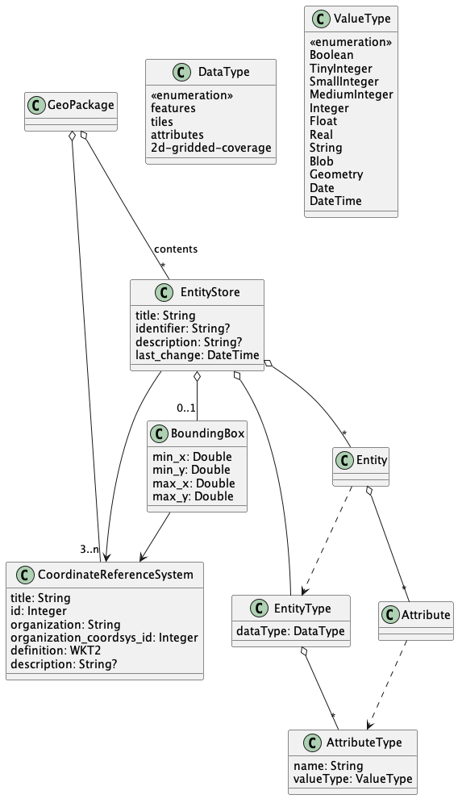
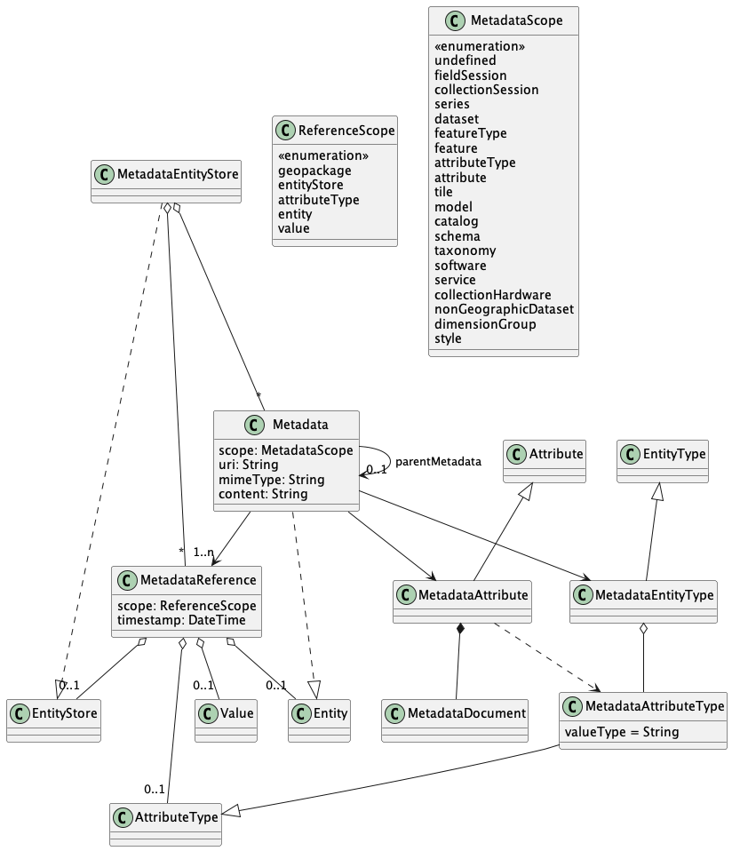
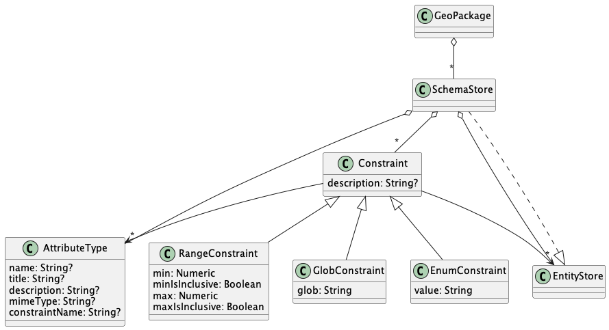
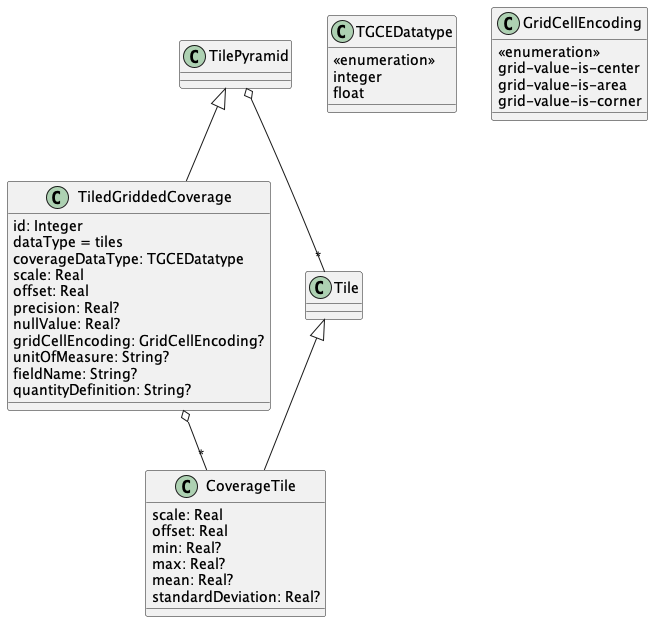
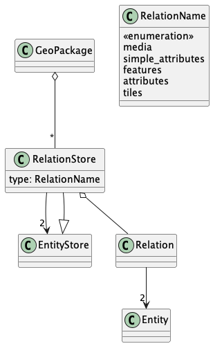

== GeoPackage Conceptual Model (Normative)
This section presents the normative definition of the GeoPackage Conceptual Model (CM).
The CM is primarily presented as UML diagrams but are augmented with text where needed.
The diagrams are intended to be normative, but if there is any discrepancy between the diagrams and the text then the text takes priority.

[NOTE]
====
Requirements are numbered to maintain alignment with OGC 12-128.
====

=== Core
A GeoPackage contains the content represented in <<Core_Classes>>.

[#Core_Classes,reftext='{figure-caption} {counter:figure-num}']
.Core GeoPackage Classes

include::requirements/requirements_class_core.adoc[]

=== Features

GeoPackages that conform to the Features Requirements Class contain the content represented in <<Features_Classes>>.

[#Features_Classes,reftext='{figure-caption} {counter:figure-num}']
.Features GeoPackage Classes
image::figures/features.png[]

include::requirements/requirements_class_features.adoc[]

=== Tiles

GeoPackages that conform to the Tiles Requirements Class contain the content represented in <<Tiles_Classes>>.

[#Tiles_Classes,reftext='{figure-caption} {counter:figure-num}']
.Tiles GeoPackage Classes

include::requirements/requirements_class_tiles.adoc[]

=== Attributes

GeoPackages that conform to the Attributes Requirements Class contain the content represented in <<Attributes_Classes>>.

[NOTE]
====
OGC 12-128 defined this concept as "attributes".
However, this conflicts with the standard definition of an attribute as a member of a class.
In this document, the term "attributes set" will be used to describe a user-defined class with multiple attributes and no geometry.
====

[#Attributes_Classes,reftext='{figure-caption} {counter:figure-num}']
.Attributes GeoPackage Classes

include::requirements/requirements_class_attributes.adoc[]

=== Extensions

GeoPackages that conform to the Extensions Requirements Class contain the content represented in <<Extensions_Classes>>.

[#Extensions_Classes,reftext='{figure-caption} {counter:figure-num}']
.Extensions GeoPackage Classes

include::requirements/requirements_class_extensions.adoc[]

=== Metadata

GeoPackages that conform to the Metadata Requirements Class contain the content represented in <<Metadata_Classes>>.

[#Metadata_Classes,reftext='{figure-caption} {counter:figure-num}']
.Metadata GeoPackage Classes

include::requirements/requirements_class_metadata.adoc[]

=== Schema

GeoPackages that conform to the Schema Requirements Class contain the content represented in <<Schema_Classes>>.

[#Schema_Classes,reftext='{figure-caption} {counter:figure-num}']
.Schema GeoPackage Classes

include::requirements/requirements_class_schema.adoc[]

=== Tiled Gridded Coverages

GeoPackages that conform to the Tiled Gridded Coverage Requirements Class contain the content represented in <<TGCE_Classes>>.

[#TGCE_Classes,reftext='{figure-caption} {counter:figure-num}']
.Tiled Gridded Coverage Extension GeoPackage Classes

include::requirements/requirements_class_tgce.adoc[]

=== Related Tables

GeoPackages that conform to the Related Tables Requirements Class contain the content represented in <<RTE_Classes>>.

[#RTE_Classes,reftext='{figure-caption} {counter:figure-num}']
.Related Tables GeoPackage Classes

include::requirements/requirements_class_rte.adoc[]
