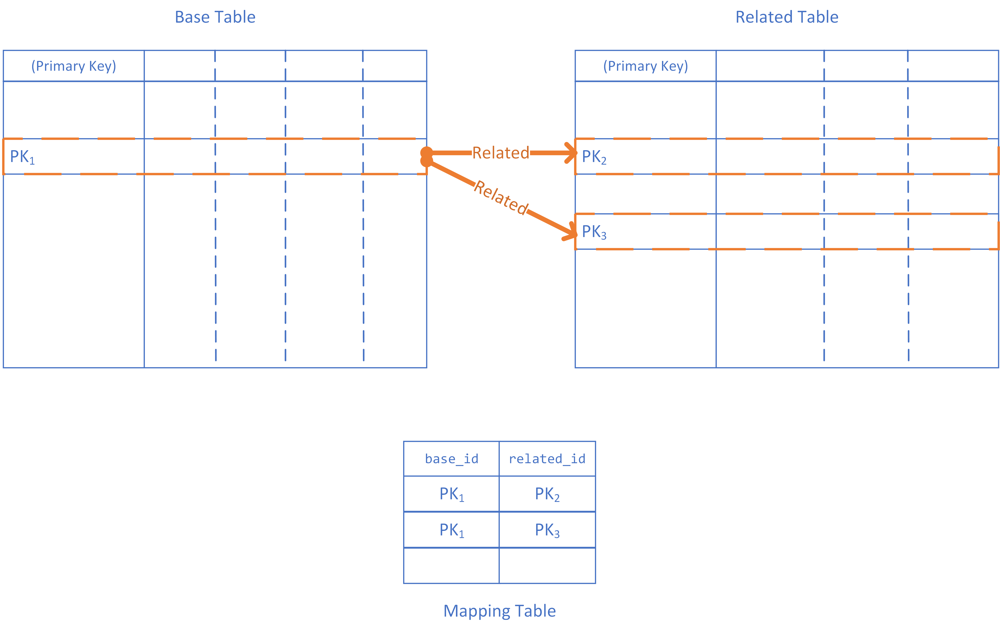
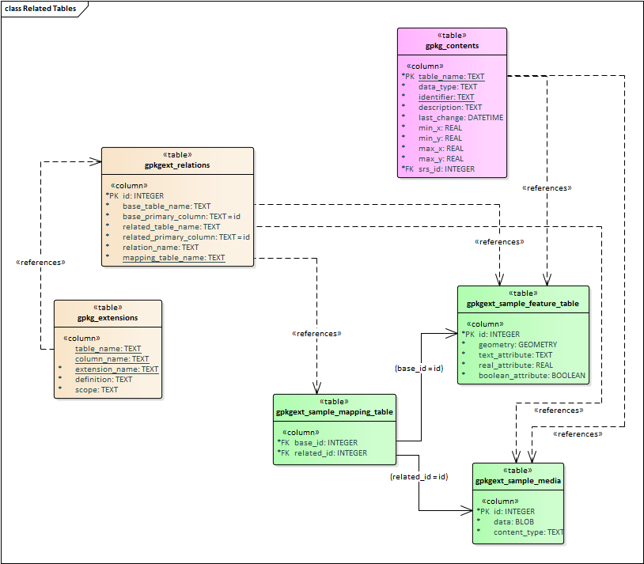
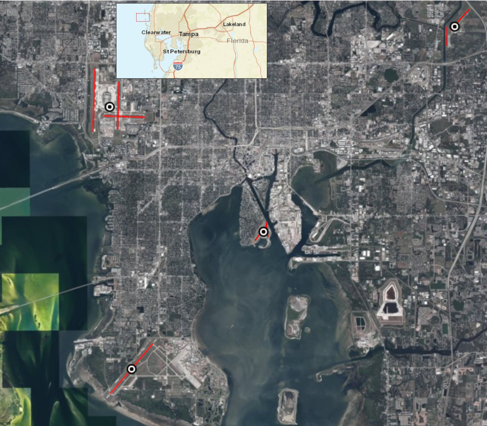
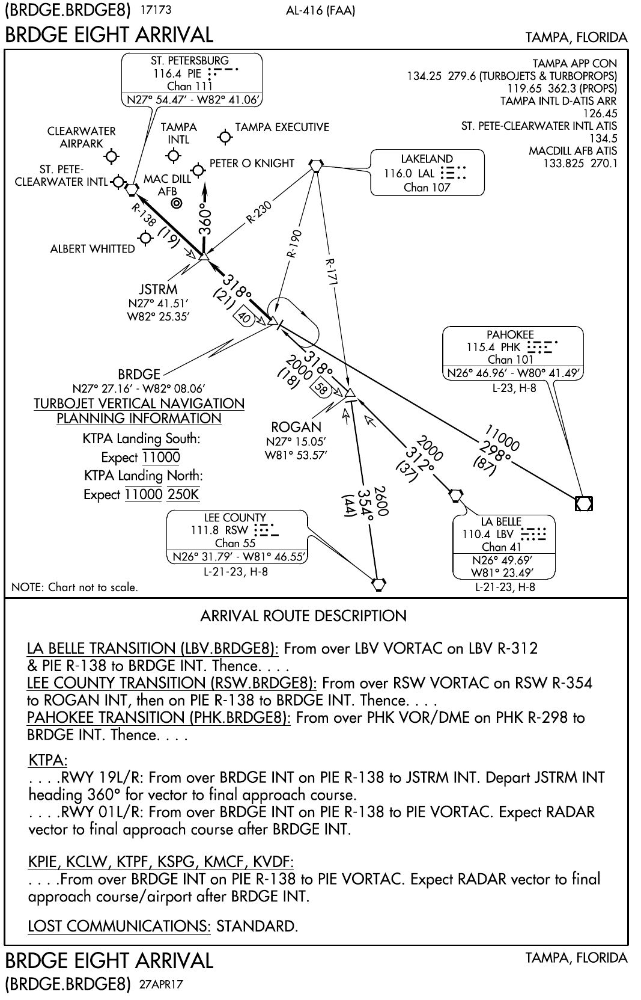

[[DesignClause]]
== Design (Informative)

=== Overview ===
The core of the Related Tables Extension is a mapping between existing table types defined by GPKG 1.2.1 - http://www.geopackage.org/spec121/#features[features], http://www.geopackage.org/spec121/#tiles[tiles], and http://www.geopackage.org/spec121/#attributes[attributes]. The mapping is defined by a new kind of table defined by the Related Tables Extension. The mapping table links related rows in those tables of those types by reference to their primary keys. For example, to link a row in Table A to a row in Table B, the mapping table includes a row that has two values - the primary key of the row from Table A, and the primary key of the row from Table B.

The mapping table allows many-to-many relationships. For example, to relate another row in Table B to the same row in Table A, the mapping table would simply include another row with the appropriate primary keys. See <<img_relatedtablesconcept>>.

[#img_relatedtablesconcept,reftext='{figure-caption} {counter:figure-num}']
.Related Tables concept

Mapping tables are unique to each pair of tables. The appropriate mapping table for each table pair (if any) is identified in a new table `gpkgext_relations`, which also specifies the name of the primary key column and the type of related data. This version of the Related Tables Extension supports five types of related data, which are separate conformance classes:

 * media
 * simple attributes
 * features
 * attributes
 * tiles

The relationships can be considered directional, in that they relate primary keys of two tables in terms of base (the "left" or "from" side of the mapping) and related (the "right" or "to" side of the mapping). Since the related tables are valid GPKG 1.2 table types (potentially with some additional constraints), they can form the base side of another mapping. This allows chaining (directed graph) of relationships as appropriate to represent the modeled data. See <<img_related_tables_uml>>.

[#img_related_tables_uml,reftext='{figure-caption} {counter:figure-num}']
.Related Tables UML Diagram

The Related Tables Extension makes no constraints on the base table; it can be any table type supported by GPKG 1.2 - tiles, attributes or features. The related ("right" / "to") table is constrained by defined values of `relation_name` which is a TEXT value in the `gpkgext_relations` table. The constraining of relationships serves two purposes - it allows clients to provide appropriate rendering of content, and it communicates the intent of the relationship. Since the relationship is text, values other than those defined by the Related Tables Extension document can be used, however this will not be interoperable without some other coordination mechanism.

=== Requirements Classes

==== Media

The Media conformance class is used for related tables that provide multimedia content. The GPKG table type is http://www.geopackage.org/spec121/#attributes[attributes]. This was the original intent of the Related Tables Interoperability Experiment, and remains an important use. For example, using a `relation_name` of `media` provides the ability to link a set of photographs, line diagrams, documents, videos and/or audio files to a specific location (typically a point or polygon feature; but the Related Tables Extension does not prohibit some other kind of feature, or a row in an attribute table, or a row in a tile table being used as the base side of the mapping to the media table). The minimum content of the user defined media table is a primary key, a BLOB containing the media content (conceptually a byte array in the GeoPackage), and the https://www.iana.org/assignments/media-types/media-types.xhtml[IANA Media Type] type for the media content (e.g., `image/jpeg` for a photograph).

An example of this is a land parcel (land lot) as the feature (base table), and photographs of the location (house, commercial property, etc.) as the related media.

Note that the related table does not need to include additional columns, although additional columns are permitted in the related table definition, so they can be added if desired. The Related Tables Extension does not constrain or codify what the additional columns can be. Specific communities of interest may wish to provide usage profiles of the Media conformance class to meet specific operational or business needs. Clients that intend to display GeoPackages that make use of the Media conformance class of the Related Tables Extension may wish to provide additional attribute display on a "best efforts" basis (e.g., view with the column names as labels for the text and numeric row values).

For example, additional column content might include:

 * An indicator of the size of the media content (although this can be determined using the SQLite `length()` function);
 * A title or description of the content of the media BLOB; and/or
 * License information, usage restrictions, or security constraints.

==== Simple Attributes

The Simple Attributes conformance class is used for related tables that include only "simple attributes" - those SQLite values that are part of the TEXT, INTEGER and REAL https://www.sqlite.org/datatype3.html#storage_classes_and_datatypes[storage classes]. The GPKG table type is http://www.geopackage.org/spec121/#attributes[attributes]. This is intended to support data that would typically be represented in Comma Separated Value (CSV) or spreadsheet formats, such as reference tables or observations. The simple attributes related table is not permitted to contain BLOB data (such as multimedia content, or feature GEOMETRY - these are covered by other conformance classes).

Only two columns are required in the related attributes table - the primary key, and one other column (which can be of TEXT, INTEGER, REAL, or a type that maps to one of those storage classes). As for Media, the Simple Attributes related table does not need to include additional columns, although additional columns are permitted in the related table definition, so they can be added if desired. The Related Tables Extension does not constrain or codify what the additional columns can be.  Specific communities of interest may wish to provide usage profiles of the Simple Attributes conformance class to meet specific operational or business needs. Clients that intend to display GeoPackages that make use of the Simple Attributes conformance class of the Related Tables Extension may wish to provide additional attribute display on a "best efforts" basis (e.g., view with the column names as labels for the text and numeric row values; or a spreadsheet-style table representation).

An example of this is a land parcel (land lot) as the feature (base table), and contact details for the managing agent as the related table. While this could be supported by embedding the contact details for each land parcel, this could be a lot of duplication and require update if a phone number or email address changes.

Note that the feature (base table) could link to many attribute table rows. An example of this would be for a set of valuations for the property, or records of property inspections or maintenance work conducted on the property.

==== Features

The Features conformance class is used for related tables that are http://www.geopackage.org/spec121/#feature_user_tables[GPKG 1.2.1 vector feature tables]. The GPKG table type is http://www.geopackage.org/spec121/#features[features]. This is intended to support defining relationships between feature types. No changes or constraints are made on the extant definition of the features tables.

An example of this is linking the location of a condominium (town house) or apartment with the locations of associated parking places or individual garden plots.

==== Attributes

The Attributes conformance class is used for related tables that comply with the GPKG http://www.geopackage.org/spec121/#attributes[attributes] table type. This is intended to support additional relationships to data which may already be stored as GPKG metadata.

As with the Simple Attributes conformance class, only two columns are required in the related attributes table - the primary key, and one other column. The Related Tables Extension does not constrain or codify what additional columns can be. Unlike a Simple Attributes table, an Attributes table may include all data types allowed in a GPKG http://www.geopackage.org/spec121/#attributes[attributes] metadata table (e.g. BLOB data types).

==== Tiles

The Tiles conformance class is used for related tables that are GPKG http://www.geopackage.org/spec121/#tiles[tiles] tables, specifically http://www.geopackage.org/spec121/#tiles_user_tables[tile pyramid] tables.

=== Usage scenario ===

A single GeoPackage could include each of these relationships. For example, an airport can be considered as a point location with some attributes, which would be represented in GeoPackage as a features table. Similarly, the runways may be considered as polygons with attributes, which would be represented in GeoPackage as a different features table. See <<img_airportsandrunways>>. The mapping between those feature tables can be represented using the Related Tables Extension, so that a graphical user interface could identify and select the runways for a particular airport, including associated attributes and metadata.

[#img_airportsandrunways,reftext='{figure-caption} {counter:figure-num}']
.Airports and runways for Tampa area (from FAA data, AIRAC cycle 1802)

In addition to feature geometry, an airport may have associated documents, such as terminal procedures. These are typically provided as PDF documents containing a mix of text and diagrams, as shown in <<img_arrivalprocedure>>. These could be common to a range of airports in a close area (which is the case for that Arrival procedure), specific to a particular airport, or they could be specific to a particular runway, as shown in <<img_gpsapproach>>.

[#img_arrivalprocedure,reftext='{figure-caption} {counter:figure-num}']
.Bridge Eight Arrival (from FAA data, AIRAC cycle 1802)

[#img_gpsapproach,reftext='{figure-caption} {counter:figure-num}']
.Tampa International RWY 19L GPS Instrument Approach(from FAA data, AIRAC cycle 1802)
image::images/gpsapproach.png[height=1000,align="center"]

This information can be represented using the user defined media table, either by incorporating the original PDF as the content of the data BLOB, or by rendering it to an image format such as PNG and using that as the content of the data BLOB. Mapping tables can relate the feature tables (e.g., airport geometry as points and runways as polygons, as described above) to the media table.

Airports may also have associated attributes that are not geospatial or media, such as the communications frequencies that are required. There are often multiple frequencies, and they are often common to multiple airports in an area. The frequency information can be represented as an attributes table, with the mapping from airport to communication frequency through a simple attributes mapping. There could well be additional attribute information, such as a mapping from the terminal procedures media table to currency (validity dates, last change) or to the responsible information provider and associated contact details.
